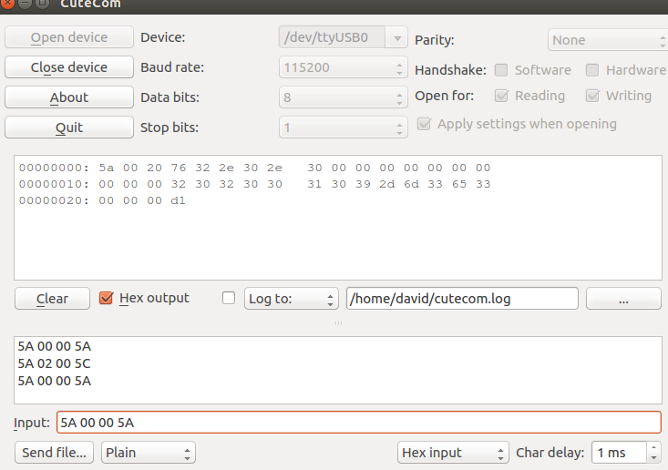
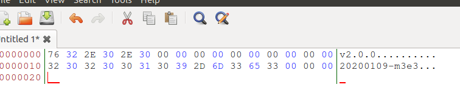
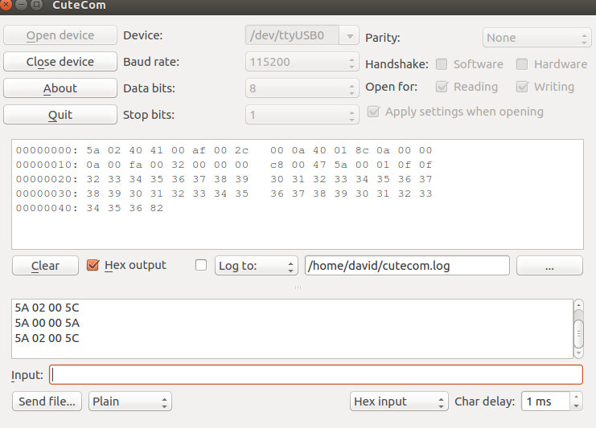
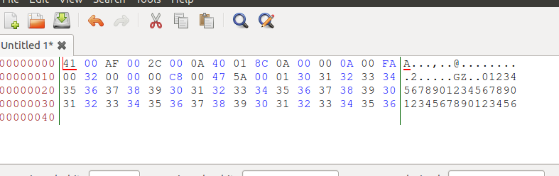
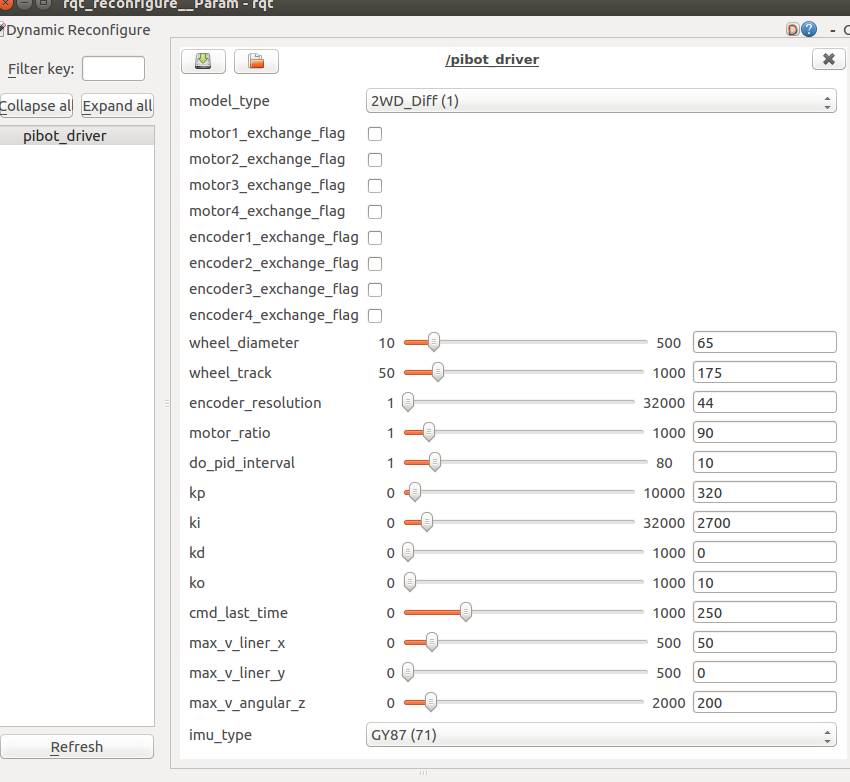
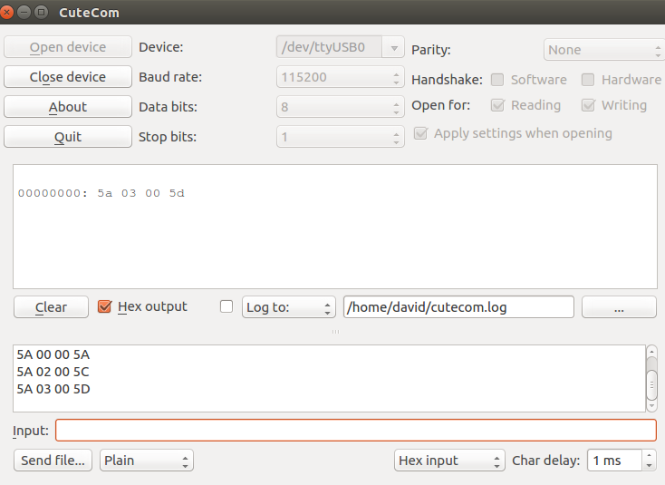

# 1. 说明
[PIBOT]()底盘驱动板[Ardunio Mega2560](https://item.taobao.com/item.htm?spm=a1z10.1-c-s.w4004-17455972993.12.35194b0c7otbLp&id=569238818315)/[STM32F1](https://item.taobao.com/item.htm?spm=a1z10.1-c-s.w4004-17455972993.12.35194b0c7otbLp&id=569238818315)/[STMF32F4](https://item.taobao.com/item.htm?spm=a1z10.1-c-s.w4004-17455972993.12.35194b0c7otbLp&id=569238818315)与上位机([树莓派](www.raspberrypi.org/)/[Jetson nano](https://www.nvidia.cn/autonomous-machines/embedded-systems/jetson-nano/)/[RK3399](https://item.taobao.com/item.htm?spm=a1z10.3-c.w4002-13059377851.22.800c49d67CTEbR&id=635166853727)等)通过串口通讯

- 通讯数据格式：
  - 波特率: `STM32F1/Arduino: 115200`, `STM32F4:921600`
   - 起始位： 1 位
   - 数据位： 8 位
   - 奇偶位： 无
   - 停止位： 1 位

# 2. 硬件板卡通讯协议定义
  板卡通讯协议使用串口进行通信,每条消息包含消息头和消息体校验码三部分,所有数字采用小端序传递
## 2.1 消息定义
每条消息都由 [消息头]+[消息体]+[校验码] 三部分组成,每条消息最大长度为3+255+1字节,消息体最大255字节
|  | 消息头 | 消息体 |校验 |
| :-----:| :----: | :----: |:----: |
| 大小(字节） | 3 | N(0-255) | 1|

### 2.1.1 消息头
  消息头C风格定义如下:
``` C
struct head
{
    unsigned char flag;// 头部标记,固定帧头:0X5A
    unsigned char msg_id;// 消息ID,表示消息具体作用,决定消息体具体格式
    unsigned char length;// 消息体长度
}
```
### 2.1.2 消息体
消息体为具体数据内容长度由消息头的消息体长度决定

### 2.1.3 校验码
  校验码固定占一个字节空间,为消息头+消息体 每个字节相加得到的结果取低8位的值

# 3. 消息详细定义
## 3.1 命令ID
|  id | description           |
| :------: | :--------------: |
| 0     | 读取固件版本         |
| 1    | 设置机器人配置参数    |
| 2     | 读取机器人配置参数    |
| 3     | 初始化里程        |
| 4     | 设置机器人实时速度    |
| 5     | 获取里程计信息      |
| 6     | 获取PID调速数据    |
| 7     | 获取IMU数据    |
| 8     | 获取编码器的计数    |
| 9     | 电机控制(调试用)    |

## 3.2 详细消息
- Master:
    PC/树莓派等上位机
- Board: 
    STM32F1/F4/Arduino主板
### 3.2.1 查询固件版本信息
- 请求:Master->Board

|  | 固定帧头 | id | 消息体长度 |消息体 |校验 |
| :-----:| :----: | :----: |:----: |:----: |:----: |
| 内容 | 0x5a | 0x00 | 0x00|-|1字节和校验码|
- 回复:Board->Master

|  | 固定帧头 | id | 消息体长度 |消息体 |校验 |
| :-----:| :----: | :----: |:----: |:----: |:----: |
| 内容 | 0x5a | 0x00 | 0x20|具体信息(见下面定义)|1字节和校验码|
```C
{
        char version[16]; //固件版本
        char time[16];  //构建时间
}
 ```
- 交互数据测试 
   - 发送(十六进制): `5a 00 00 5a`
   - 接收(十六进制): `5a 00 20 76 32 2e 30 2e  30 00 00 00 00 00 00 00  00 00 00 32 30 32 30 30  31 30 39 2d 6d 33 65 33 00 00 00 d1`
  
```
固定帧头:0x5a
消息id:0x00
消息体长度:0x20(32)
消息体:76 32 2e 30 2e 30 00 00 00 00 00 00 00  00 00 00 32 30 32 30 30  31 30 39 2d 6d 33 65 33 00 00 00
校验码: d1
```


### 3.2.2 设置机器人配置参数
- 请求:Master->Board

|  | 固定帧头 | id | 消息体长度 |消息体 |校验 |
| :-----:| :----: | :----: |:----: |:----: |:----: |
| 内容 | 0x5a | 0x01 | 0x40|具体信息(见下面定义)|1字节和校验码|
```C
{
  union {
       char buff[64];
       struct
       {   
            unsigned short wheel_diameter;      //轮子直径  mm
            unsigned short wheel_track;         //差分：轮距， 三全向轮：直径，四全向：前后轮距+左右轮距 mm
            unsigned short encoder_resolution;  //编码器分辨率
            unsigned char do_pid_interval;      //pid间隔 (ms)
            unsigned short kp;
            unsigned short ki;
            unsigned short kd;
            unsigned short ko;                  //pid参数比例
            unsigned short cmd_last_time;       //命令持久时间ms 超过该时间会自动停止运动
            unsigned short max_v_liner_x;       // 最大x线速度
            unsigned short max_v_liner_y;       // 最大y线速度
            unsigned short max_v_angular_z;     // 最大角速度
            unsigned char imu_type;             // imu类型 gy85: 69, gy87:71,gy65:49
            unsigned short motor_ratio;         // 电机减速比
            unsigned char model_type;           // 运动模型类型 2wd-diff:1, 4wd-diff:2, 3wd-omni:101, 4wd-omni:102,4wd-mecanum:201
            unsigned char motor_nonexchange_flag;      // 电机标志参数        1 正接      0 反接(相当于电机线交换)
            unsigned char encoder_nonexchange_flag;    // 编码器标志参数      1 正接      0 反接(相当于编码器ab相交换)
        }
    }
}
```
- 回复:Board->Master

|  | 固定帧头 | id | 消息体长度 |消息体 |校验 |
| :-----:| :----: | :----: |:----: |:----: |:----: |
| 内容 | 0x5a | 0x01 | 0x00|-|1字节和校验码|

### 3.2.3 读取机器人配置参数
- 请求:Master->Board

|  | 固定帧头 | id | 消息体长度 |消息体 |校验 |
| :-----:| :----: | :----: |:----: |:----: |:----: |
| 内容 | 0x5a | 0x02 | 0x00|-|1字节和校验码|
- 回复:Board->Master

|  | 固定帧头 | id | 消息体长度 |消息体 |校验 |
| :-----:| :----: | :----: |:----: |:----: |:----: |
| 内容 | 0x5a | 0x02 | 0x40|具体信息(同设置参数的消息体)|1字节和校验码|

- 交互数据测试 
   - 发送(十六进制): `5a 02 00 5c`
   - 接收(十六进制): `5a 02 40 41 00 af 00 2c 00 0a 40 01 8c 0a 00 00 0a 00 fa 00 32 00 00 00 c8 00 47 5a 00 01 0f 0f 32 33 34 35 36 37 38 39 30 31 32 33 34 35 36 37 38 39 30 31 32 33 34 35   36 37 38 39 30 31 32 33  34 35 36 82`

```
固定帧头:0x5a
消息id:0x02
消息体长度:0x40(64)
消息体:41 00 af 00 2c 00 0a 40 01 8c 0a 00 00 0a 00 fa 00 32 00 00 00 c8 00 47 5a 00 01 0f 0f 32 33 34 35 36 37 38 39 30 31 32 33 34 35 36 37 38 39 30 31 32 33 34 35   36 37 38 39 30 31 32 33  34 35 36
校验码: 82
```


消息体内容对应参数已经`pibot_configure`命令结果如下: 
```
   wheel_diameter=0x0041;  // (65mm)  //轮子直径  mm
   wheel_track=0x00af; // (175mm)      //差分：轮距， 三全向轮：直径，四全向：前后轮距+左右轮距 mm
   encoder_resolution=0x002c; // 44 //编码器分辨率
   do_pid_interval=0x0a; // 10 //pid间隔 (ms)
   kp=0x0140; // 320
   ki=0x0a8c;  // 2700
   kd=0x0000; // 0
   ko=0x000a; // 0
   cmd_last_time=0x00fa;// 250 //命令持久时间ms 超过该时间会自动停止运动
   max_v_liner_x=0x0032; // 50  // 最大x线速度
   max_v_liner_x=0x0000; // 0   // 最大y线速度
   max_v_liner_x=0x00c8;// 200 // 最大角速度
   imu_type=0x47;    //71 (GY87)  // imu类型 参见gy85: 69, gy87:71,gy65:49
   motor_ratio=0x005a;    //90   // 电机减速比
   model_type=0x01;    //1(2wd-diff)  // 运动模型类型 2wd-diff:1, 4wd-diff:2, 3wd-omni:101, 4wd-omni:102,4wd-mecanum:201
  model_type=0x0f; // 0b1111(全部正接) // 电机标志参数        1 正接      0 反接(相当于电机线交换)
  encoder_nonexchange_flag=0x0f; // 0b1111(全部正接) // 编码器标志参数      1 正接      0 反接(相当于编码
```


### 3.2.4 初始化里程
- 请求:Master->Board

|  | 固定帧头 | id | 消息体长度 |消息体 |校验 |
| :-----:| :----: | :----: |:----: |:----: |:----: |
| 内容 | 0x5a | 0x03 | 0x00|-|1字节和校验码|
- 回复:Board->Master

|  | 固定帧头 | id | 消息体长度 |消息体 |校验 |
| :-----:| :----: | :----: |:----: |:----: |:----: |
| 内容 | 0x5a | 0x03 | 0x00|-|1字节和校验码|


### 3.2.5 设置机器人实时速度
> 设置机器人速度为激励模式， 即需要一直发送，超过设定时间未接收到该命令，机器人会自动停止
- 请求:Master->Board

|  | 固定帧头 | id | 消息体长度 |消息体 |校验 |
| :-----:| :----: | :----: |:----: |:----: |:----: |
| 内容 | 0x5a | 0x04 | 0x06|速度(见下面定义)|1字节和校验码|
    ```C
    {
        short v_liner_x; //线速度 前>0 cm/s
        short v_liner_y; //差分轮 为0  cm/s
        short v_angular_z; //角速度 左>0 0.01rad/s  100 means 1 rad/s
    }
    ```
- 回复:Board->Master

|  | 固定帧头 | id | 消息体长度 |消息体 |校验 |
| :-----:| :----: | :----: |:----: |:----: |:----: |
| 内容 | 0x5a | 0x04 | 0x00|-|1字节和校验码|


- 交互数据测试 
   - 发送(十六进制): `5a 04 06 14 00 00 00 00 00 78 `
   - 接收(十六进制): `5a 04 00 5e `
```
   v_liner_x=0x0014; //20cm/s 0.2m/s //线速度 前>0 cm/s
   v_liner_y=0x0000; //0cm/s  //线速度 前>0 cm/s
   v_angular_z=0x0000; //0rad/s  //角速度 左>0 0.01rad/s  100 means 1 rad/s
```
### 3.2.6 获取里程计信息
- 请求:Master->Board

|  | 固定帧头 | id | 消息体长度 |消息体 |校验 |
| :-----:| :----: | :----: |:----: |:----: |:----: |
| 内容 | 0x5a | 0x05 | 0x00|-|1字节和校验码|

- 回应::Board->MASTER

|  | 固定帧头 | id | 消息体长度 |消息体 |校验 |
| :-----:| :----: | :----: |:----: |:----: |:----: |
| 内容 | 0x5a | 0x05 | 0x10|里程计信息(见下面说明)|1字节和校验码|
    ```C
    {
        short v_liner_x;      //线速度 前>0 后<0  cm/s
        short v_liner_y;      //差分轮 为0        cm/s
        short v_angular_z;    //角速度 左>0 右<0  0.01rad/s   100 means 1 rad/s
        long x;              //里程计坐标x       cm (这里long为4字节，下同)
        long y;              //里程计坐标y       cm
        short yaw;            //里程计航角        0.01rad     100 means 1 rad
    }
    ```
- 交互数据测试 
   - 发送(十六进制): `5a 05 00 5f`
   - 接收(十六进制): `5a 05 10 00 00 00 00 00  00 00 00 00 00 00 00 00 00 00 00 6f`
```
固定帧头:0x5a
消息id:0x05
消息体长度:0x10(2+2+2+4+4+2=16)
消息体:00 00 00 00 00  00 00 00 00 00 00 00 00 00 00 00 //初始化后全为0
校验码: 6f
```

### 3.2.7 获取PID调速数据
- 请求:Master->Board

|  | 固定帧头 | id | 消息体长度 |消息体 |校验 |
| :-----:| :----: | :----: |:----: |:----: |:----: |
| 内容 | 0x5a | 0x06 | 0x00|-|1字节和校验码|

- 回应::Board->MASTER

|  | 固定帧头 | id | 消息体长度 |消息体 |校验 |
| :-----:| :----: | :----: |:----: |:----: |:----: |
| 内容 | 0x5a | 0x06 | 0x20|PID信息(见下面说明)|1字节和校验码|

 ```C
 {
      long input[4];  //各轮子驱动输入值
      long output[4]; //个轮子输出值
 }
 ```

### 3.2.8 获取IMU数据
- 请求:Master->Board

|  | 固定帧头 | id | 消息体长度 |消息体 |校验 |
| :-----:| :----: | :----: |:----: |:----: |:----: |
| 内容 | 0x5a | 0x07 | 0x00|-|1字节和校验码|

- 回应::Board->MASTER

|  | 固定帧头 | id | 消息体长度 |消息体 |校验 |
| :-----:| :----: | :----: |:----: |:----: |:----: |
| 内容 | 0x5a | 0x07 | 0x24|9轴IMU信息(见下面说明)|1字节和校验码|

 ```C
 {
    float ax, ay, az; // 三轴加速度计值 m/s2
    float gx, gy, gz;// 三轴陀螺仪计值 rad/s
    float mx, my, mz;// 三轴磁力计计值mg（0.001GAUSS)
 }
 ```
- 交互数据测试 
   - 发送(十六进制): `5A 07 00 61`
   - 接收(十六进制): `5a 07 24 49 32 8e 3d 4e a6 5c 3e 1e fc 12 41 58 a0 0b 3c 7e b6 c8 bc 58 a0 8b bb e1 7a 04 c2 8f 42 81 43 7b 94 94 c3 17`
```
固定帧头:0x5a
消息id:0x07
消息体长度:0x24(4*9=36)
消息体:49 32 8e 3d 4e  a6 5c 3e 1e fc 12 41 58 a0 0b 3c 7e b6 c8 bc 58 a0 8b bb e1 7a 04 c2 8f 42 81 43 7b 94 94 c3
校验码: 17

// 三轴加速度计值 m/s2
ax=[49 32 8e 3d]  // 0.0694318488
ay=[4E A6 5C 3E]  // 0.215478152
az=[1E FC 12 41]  // 9.18655205

// 三轴陀螺仪计值 rad/s
gx=[58 A0 0B 3C] // 0.00852211565
gy=[7E B6 C8 BC] // -0.0245010816
gz=[58 A0 8B BB] // -0.00426105782

// 三轴磁力计计值mg（0.001GAUSS)
mx=[E1 7A 04 C2] // -33.1199989
my=[8F 42 81 43] // 258.519989
mz=[7B 94 94 C3] // -297.160004
```

### 3.2.9 获取编码器的计数数据
- 请求:Master->Board

|  | 固定帧头 | id | 消息体长度 |消息体 |校验 |
| :-----:| :----: | :----: |:----: |:----: |:----: |
| 内容 | 0x5a | 0x08 | 0x00|-|1字节和校验码|

- 回应::Board->MASTER

|  | 固定帧头 | id | 消息体长度 |消息体 |校验 |
| :-----:| :----: | :----: |:----: |:----: |:----: |
| 内容 | 0x5a | 0x08 | 0x10|编码器计数(见下面说明)|1字节和校验码|

 ```C
 {
    float encoder_count[4]; // 各电机编码器计数
 }
```

### 3.2.10 电机控制
- 请求:Master->Board

|  | 固定帧头 | id | 消息体长度 |消息体 |校验 |
| :-----:| :----: | :----: |:----: |:----: |:----: |
| 内容 | 0x5a | 0x09 | pwm(见下面说明)|-|1字节和校验码|
```C
 {
    short pwm[4]; // 各输出控制电机的pwm
 }
```
- 回应::Board->MASTER

|  | 固定帧头 | id | 消息体长度 |消息体 |校验 |
| :-----:| :----: | :----: |:----: |:----: |:----: |
| 内容 | 0x5a | 0x09 | 0x00|-|1字节和校验码|
